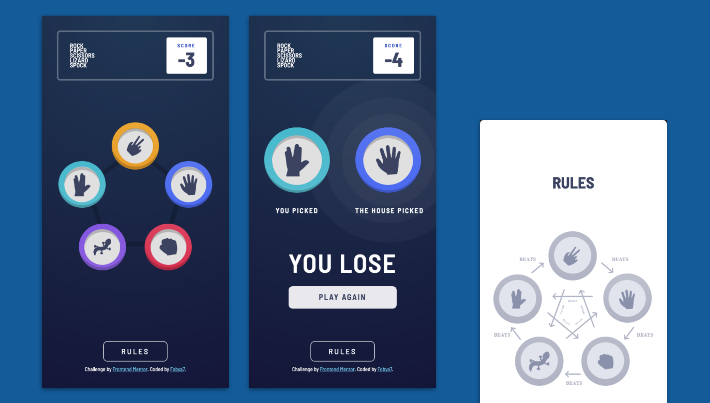

# Rock-Paper-Scissors Angular SPA with animation and SCSS styling

This is a solution to the [Rock, Paper, Scissors challenge on Frontend Mentor](https://www.frontendmentor.io/challenges/rock-paper-scissors-game-pTgwgvgH).

And woah, it was a journey! 35 hours of work across 3 and a half days. My second ever project in Angular too, so I was learning on the go a lot.

## Table of contents

<!-- pls do it, this is long -->

- [Overview](#overview):
    - [Challange description](#the-challenge),
    - [Solution](#solution);

- [My process](#my-process):
    - [Built with](#built-with),
    - [What I learned](#what-i-learned),
    - [Continued development](#Continued-development).

## Overview

### The challenge

Users should be able to:

- View the optimal layout for the game depending on their device's screen size
- Play Rock, Paper, Scissors against the computer
- Maintain the state of the score after refreshing the browser _(optional)_
- **Bonus**: Play Rock, Paper, Scissors, Lizard, Spock against the computer _(optional)_

### Solution

Check it out live [here]()!

Or the next best thing - this gif:

| Desktop |
| --- |
|  |

| Mobile |
| --- |
|  |

<!-- remember about screenies! -->

## My process

### Built with

- Semantic HTML5 markup (using Flexbox)
- SCSS (using mixins, flow control, and media queries)
- [Angular](https://angular.io/) framework (using parametized animations, structural directives, and cookies)

### What I learned

Quite a lot.

- At first I dove deep into [radial gradients](https://developer.mozilla.org/en-US/docs/Web/CSS/gradient/radial-gradient) for the background.

#### Then I needed a lot info on Angular / TypeScript:

- like [event binding](https://angular.io/guide/event-binding),

- [passing functions between components](https://medium.com/@7hwyl/how-to-pass-a-function-to-a-child-component-in-angular-719fc3d1ee90),

- how to use an [ngSwitch](https://angular.io/api/common/NgSwitch),

- and an [equivalent to sleep / wait functions](https://stackoverflow.com/questions/37764665/how-to-implement-sleep-function-in-typescript),

- and [enums](https://dev.to/shane/working-with-enums-in-angular-html-templates-2io9), namely [iterating through a typescript enum](https://stackoverflow.com/questions/38554562/how-can-i-use-ngfor-to-iterate-over-typescript-enum-as-an-array-of-strings)
and [getting a random enum](https://stackoverflow.com/questions/44230998/how-to-get-a-random-enum-in-typescript),
tho i needed [official docs on the random function](https://developer.mozilla.org/en-US/docs/Web/JavaScript/Reference/Global_Objects/Math/random)
to fully comprehend the solution.

- [Cookies](https://stackoverflow.com/questions/34298133/angular-cookies) for the persisting score.

- Also - this neat JS / TS trick with [turning strings into numbers](https://stackoverflow.com/questions/14667713/how-to-convert-a-string-to-number-in-typescript).

#### And then there was SCSS Styling;

- working on [the inset button shadows](https://stackoverflow.com/questions/27212782/box-shadow-circle), which led me to learning in detail about [box shadows](https://developer.mozilla.org/en-US/docs/Web/CSS/box-shadow),

- [passing variables to scss](https://www.intertech.com/using-css-variables-in-angular/),

- [Sass ifs and mixins](https://sass-lang.com/documentation/at-rules/control/if),

- then Sass flow control; which I learned from [docs](https://sass-lang.com/documentation/at-rules/control), but this [tutorial](https://www.gavsblog.com/blog/for-each-while-loops-sass-scss) made it click,

- and - [class variables](https://stackoverflow.com/questions/41861319/angular2-set-css-class-to-component-variable-value).

I finished up the project with some animations;

- I learned the basics from [docs](https://angular.io/guide/animations) along with this [additional guidance](https://indepth.dev/posts/1285/in-depth-guide-into-animations-in-angular),

- fixed animations not applying, after [learning about elements leaving the DOM](https://stackoverflow.com/a/36417971/12731017).

- Made some animations [loop](https://stackoverflow.com/questions/47396509/repeat-animation-angular-4), and some of them [parameterized](https://stackoverflow.com/questions/50806212/how-to-use-input-parameters-in-angular-6-animation).

### Continued development

- I would love to deepen my knowlage on Angular animations and Sass mixins.

- And then there is the process itself. Two days into work I had an epiphany. From 'this SPA is an actual product' perspective, it would be better, if I worked on it in stages rather than hoping from one detail to another.
